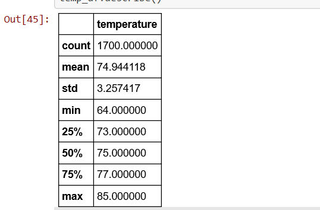

# surfs_up

# Overview

This project was done in an effort to scope the business viability of a potential surf and ice cream shop business to be located in Oahu. The owner of the business was interested in getting information regarding temperature data for the months of June and December in Oahu in order to determine if the business might be sustainable year round in this location.

# Results

* In order to accomplish this ask from the business owner a sqlite file containing information regarding the temperature data in Oahu was queried.
The results for the month of June can be seen below:

The most important information to be gained from this is the mean temperature of 74.9 degrees fahrenheit with a standard deviation of 3.2 degrees.

* The results for the second query for the month of december can be viewed below:

Again the most important information here is the mean temperature of 71.0 degrees with a standard deviation of 3.7 degrees.

* From these queries we can see how Oahu has relatively stable temperature with the mean temperature not fluctuating all that much between the months of June and December. This could be useful information for a prospective store owner who's business might be negatively affect by weather conditions.

# Analysis

From the above queries we can view how the mean temperature difference between the months of June and December is only different by about 4 degrees with relatively similar standard deviations between the two months. The prospective owner of the ice cream and surf shop would likely be encouraged by these results as it demonstrates that the weather conditions in Oahu are relatively stable. As such the owner would likely not have a span of months where his business is substantially negatively affected due to poor weather conditions.

Additional information that might prove useful in this scenario are average precipitation amounts by month as well as checking average tourism in the area and how seasonal changes might affect this.
